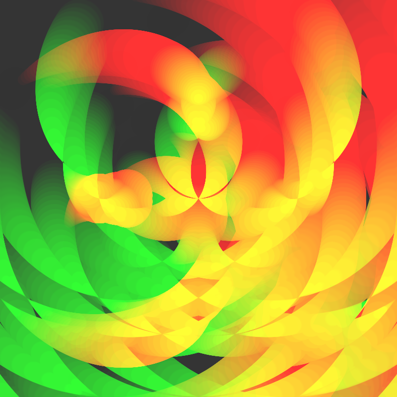
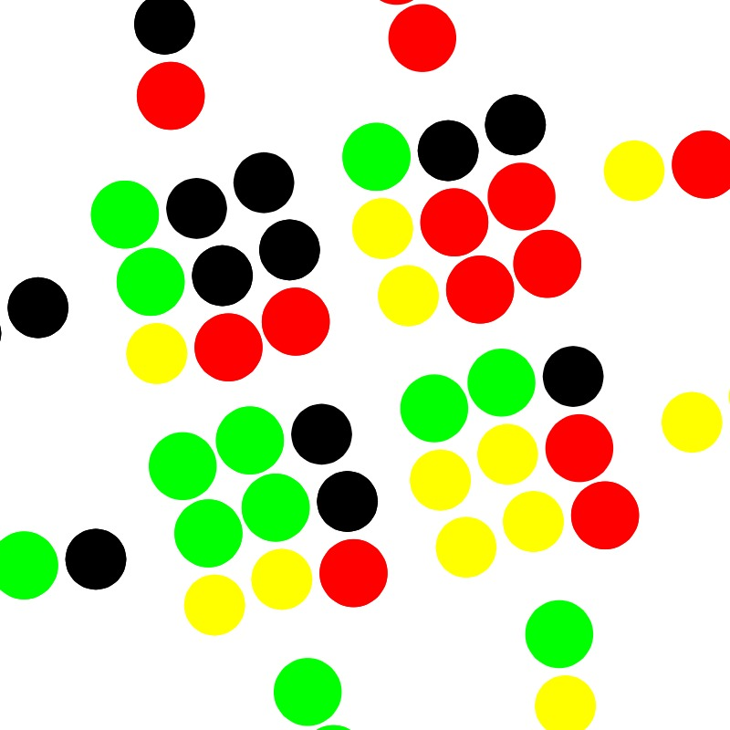
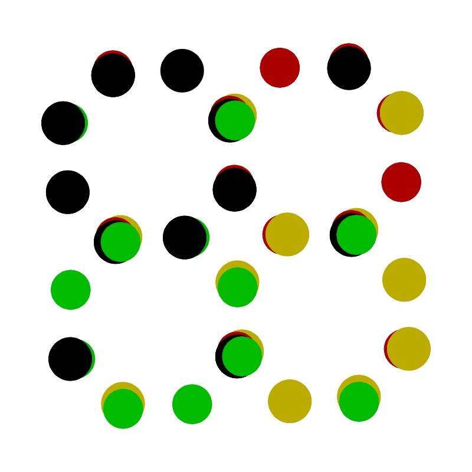
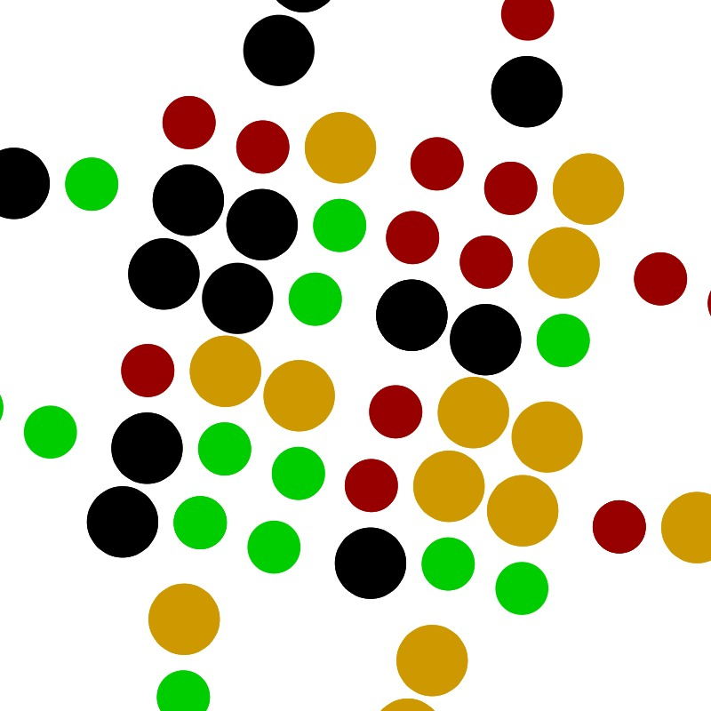
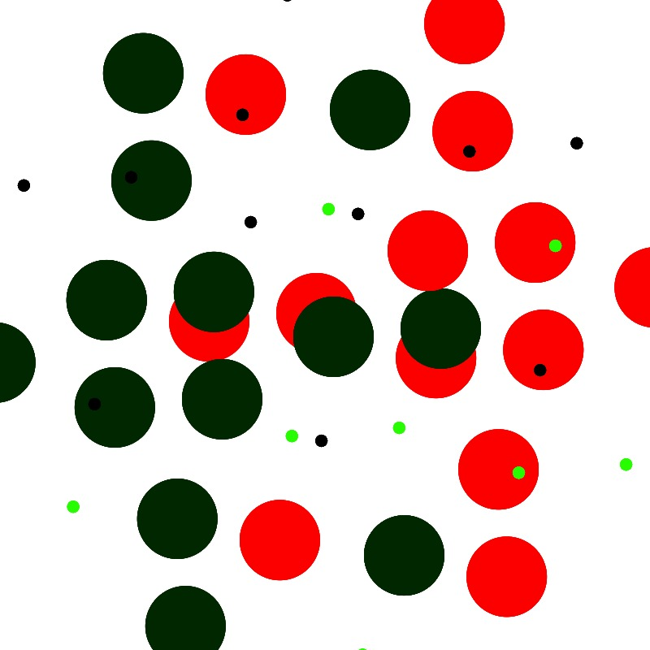

# Genuary 2021 0101

## Triple nested loop
Three loops plot circles.

First loop centres circles on the canvas.

Second and third loops centre circles on the perimeter of the circles from the previous loop.

## Live version
https://scrich.co.uk/genuary2021/20210101/

## Example images

